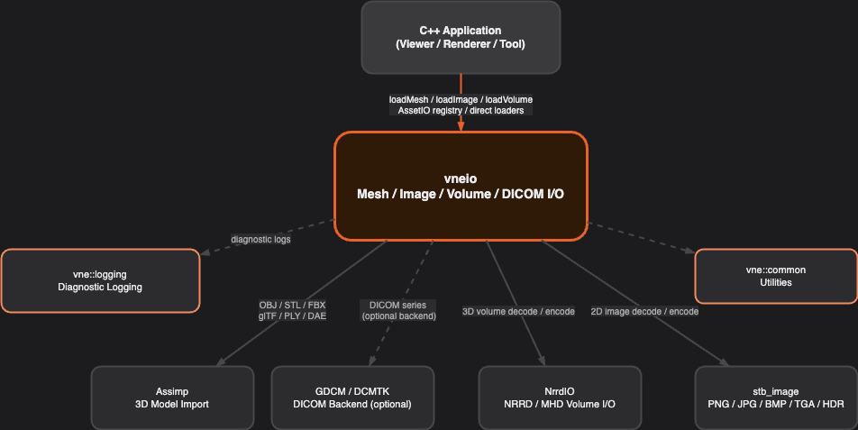
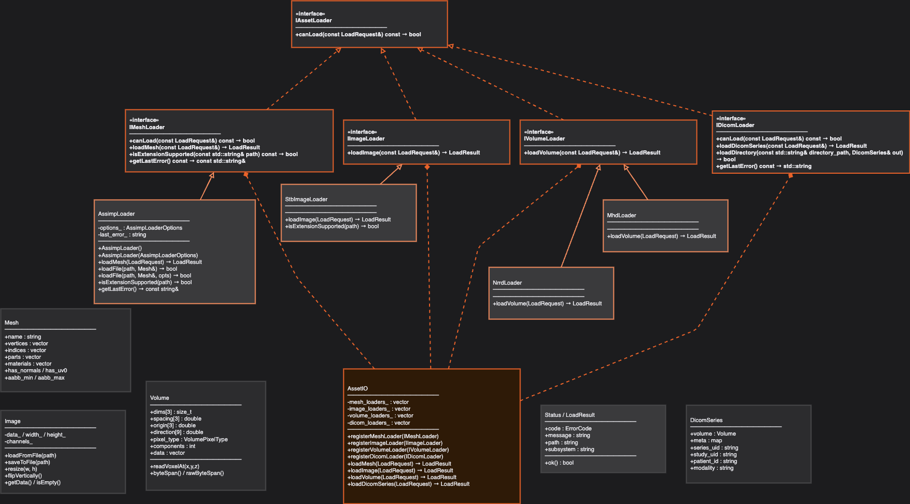
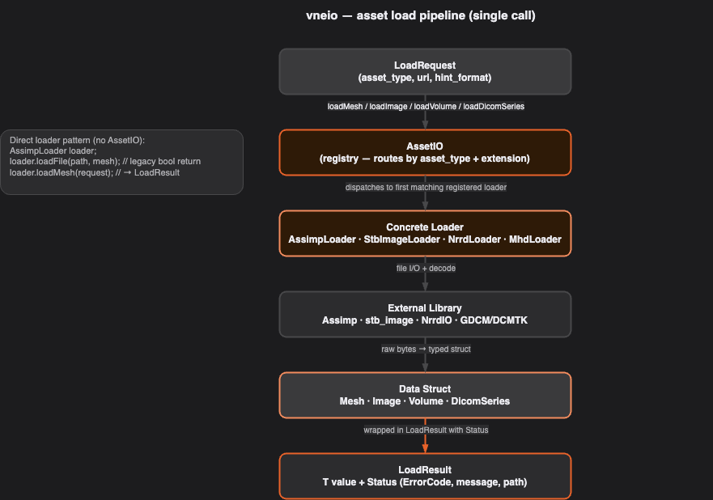
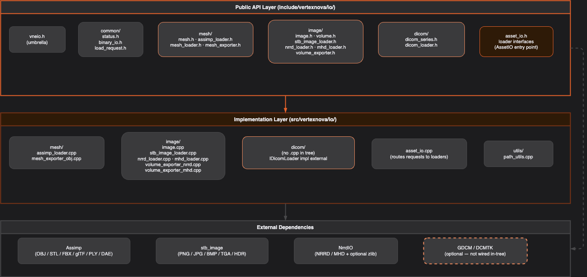

# VertexNova I/O

## Overview

The **VertexNova I/O** library (`vneio`) provides modular, production-ready asset loading and exporting for 3D meshes, 2D images, 3D medical volumes, and DICOM series. It is structured like other VertexNova libraries (**vneevents**, **vnelogging**, **vnemath**) and makes no assumptions about windowing, rendering, or GPU state — all operations are CPU-side and headless.

**Characteristics:**

- **Component-modular** — Mesh, Image, Volume, and DICOM subsystems are independently buildable (`VNEIO_BUILD_MESH`, `VNEIO_BUILD_IMAGE`). Link only what you need via `vne::io::mesh`, `vne::io::image`, or the aggregate `vne::io`.
- **Stable error model** — Every load returns a `LoadResult<T>` carrying a `Status` with a stable `ErrorCode` enum, message, file path, and subsystem string. No exceptions required.
- **Single entry point** — `AssetIO` is the canonical API. Register loaders once, then call `loadMesh` / `loadImage` / `loadVolume` / `loadDicomSeries`. The registry routes each `LoadRequest` to the first registered loader that claims support for the extension.
- **Options at construction** — Loader-specific options (e.g. `AssimpLoaderOptions`) are baked into the loader at construction, keeping `LoadRequest` format-agnostic.
- **Pluggable backends** — DICOM decoding is not built in-tree; only `IDicomLoader` / `DicomSeries` headers ship. Register your own loader with `AssetIO::registerDicomLoader()`.



**Figure 1 — System context**

| Element | Description |
|---------|-------------|
| C++ Application | Your renderer, viewer, tool, or pipeline: calls `loadMesh` / `loadImage` / `loadVolume` / `loadDicomSeries` via direct loaders or the `AssetIO` registry. |
| vneio | This library: loader interfaces, concrete loaders, registries, data structs, exporters. |
| Assimp | Third-party 3D model import library; consumed by `AssimpLoader`. Supports OBJ, STL, FBX, glTF, PLY, DAE, and more. |
| stb_image | Header-only image decode/encode; consumed by `StbImageLoader` and `Image`. Supports PNG, JPG, BMP, TGA, HDR. |
| NrrdIO | Teem's NRRD I/O library; consumed by `NrrdLoader` and `MhdLoader` for 3D volume data with optional gzip compression. |
| GDCM / DCMTK | Not bundled with vneio; supply your own `IDicomLoader` if you need DICOM decode. |
| vne::logging | Optional diagnostic logging; the library uses categorized log macros internally. |
| vne::common | Shared VertexNova utilities. |

**Diagram colors** — Draw.io sources in `diagrams/` use the [VertexNova visual style](https://learnvertexnova.com/docs/docs/misc/visual-style/) **primary palette** (canvas `#1C1C1E`, panels `#2C2C2E` / `#3A3A3C`, borders `#48484A`, accent orange `#E8622A` on tint `#2E1A07`, secondary stroke `#F28C5E`, text `#EBEBF0` / muted `#AEAEB2`).

If a PNG does not load, export the matching `.drawio` from [diagrams.net](https://app.diagrams.net).



**Figure 2 — Class diagram (major types and relationships)**

| Group | Types |
|-------|-------|
| Interfaces | `IAssetLoader` (base), `IMeshLoader`, `IImageLoader`, `IVolumeLoader`, `IDicomLoader`. |
| Concrete loaders | `AssimpLoader`, `StbImageLoader`, `NrrdLoader`, `MhdLoader`. |
| Registry | `AssetIO` — registers and dispatches all loader types. |
| Data structures | `Mesh`, `Image`, `Volume`, `DicomSeries`. |
| Error types | `Status`, `LoadResult<T>`, `ErrorCode`. |

Export `diagrams/class.drawio` → `diagrams/class.png`.



**Figure 3 — Runtime pipeline (single asset load call)**

| Stage | Role |
|-------|------|
| LoadRequest | Caller constructs a request: `asset_type`, `uri`, optional `hint_format`. |
| AssetIO | Looks up the registered loader(s) matching the extension or hint; dispatches to the first match. |
| Concrete Loader | Opens the file via the appropriate external library; validates format. |
| External Library | Decodes raw bytes (Assimp, stb_image, NrrdIO, or DICOM backend). |
| Data Struct | Loader fills a typed struct (`Mesh`, `Image`, `Volume`, or `DicomSeries`). |
| LoadResult\<T\> | Struct is returned wrapped in `LoadResult<T>` with `Status`. Caller checks `.ok()`. |

The first page of `diagrams/runtime.drawio` (**1. Asset load pipeline**) is the source for this figure; export it to `diagrams/runtime-pipeline.png`. The same file's other tabs (**2. Mesh load**, **3. Volume load**) show component-specific sequences.

## Architecture

The design is **layered**: the application constructs a `LoadRequest` and calls either a direct loader or `AssetIO`; loaders delegate to external libraries and fill typed data structures; the result is returned as `LoadResult<T>`.

| Layer | Responsibility |
|-------|----------------|
| **Application** | Asset pipeline, renderer, or tool; constructs `LoadRequest`, inspects `LoadResult<T>`. |
| **AssetIO (registry)** | Routes requests to the registered loader by `AssetType` and file extension. Optional — direct loader use is equally valid. |
| **Loader interface** | `IMeshLoader`, `IImageLoader`, `IVolumeLoader`, `IDicomLoader` — stable contracts for loader registration and dispatch. |
| **Concrete loader** | `AssimpLoader`, `StbImageLoader`, `NrrdLoader`, `MhdLoader` — each wraps an external library and translates its data model into a VertexNova struct. |
| **External library** | Assimp, stb_image, NrrdIO, or GDCM/DCMTK — the actual file-format decoders. |
| **Data struct** | `Mesh`, `Image`, `Volume`, `DicomSeries` — plain C++ structs; no virtual methods, safe to copy or move. |



**Figure 4 — Public API vs implementation (layer view)**

| Swimlane | Contents |
|----------|----------|
| Public API | `vneio.h` (umbrella), `common/` (status, binary_io, load_request), `mesh/` headers, `image/` headers, `dicom/` headers, `asset_io.h`. |
| Implementation | Per-component `.cpp` files: `assimp_loader.cpp`, `stb_image_loader.cpp`, `nrrd_loader.cpp`, `mhd_loader.cpp`, exporters, `asset_io.cpp`, `path_utils.cpp`. |
| External | Assimp, stb_image, NrrdIO (DICOM decode is external to this repo). |

Export `diagrams/component.drawio` → `diagrams/component.png`.

## Error model

- **`ErrorCode`** — Stable enum values: `eOk`, `eFileNotFound`, `eUnsupportedFormat`, `eReadError`, `eInvalidData`, `eOutOfMemory`, and more. Use codes in switch statements; do not match on message strings.
- **`Status`** — Bundles `code`, `message`, `path`, `subsystem`. Returned from every loader call via `LoadResult<T>`.
- **`LoadResult<T>`** — Template wrapper: holds a `T value` and a `Status`. Call `.ok()` to check success; access `.value` and `.status` directly.

```cpp
auto result = assetIO.loadMesh(LoadRequest{AssetType::eMesh, "model.glb"});
if (!result.ok()) {
    // result.status.code, result.status.message
}
const vne::mesh::Mesh& mesh = result.value;
```

## Key components

### Mesh component (`vne::mesh` / `vne::Mesh`)

#### `AssimpLoader`

Wraps the Assimp 3D import library. Register with `AssetIO` using `loadMesh(LoadRequest)` → `LoadResult<Mesh>`. Pass loader options at construction so `AssetIO` callers stay format-agnostic:

```cpp
AssimpLoaderOptions opts;
opts.generate_barycentrics = true;
io.registerMeshLoader(std::make_unique<AssimpLoader>(opts));
```

For direct use without `AssetIO`, `loadFile(path, Mesh&)` and `loadFile(path, Mesh&, opts)` are available on the concrete class.

**`AssimpLoaderOptions`** controls post-processing:

| Option | Default | Description |
|--------|---------|-------------|
| `flip_uvs` | true | Flip V texture coordinate. |
| `gen_tangents` | true | Generate tangent and bitangent vectors. |
| `triangulate` | true | Triangulate polygonal faces. |
| `calc_normals_if_missing` | false | Compute per-vertex normals when absent. |
| `pre_transform_vertices` | true | Flatten node hierarchy into a single mesh. |
| `ensure_ccw_winding` | true | Ensure counter-clockwise triangle winding. |
| `normalize_to_unit_sphere` | false | Rescale and center geometry. |
| `generate_barycentrics` | false | Compute barycentric coordinates per vertex (see `VertexAttributes::barycentric`). |

**Supported formats** — The **default vendored Assimp** build in vneio sets `ASSIMP_BUILD_ALL_IMPORTERS_BY_DEFAULT=OFF` and enables **OBJ, STL, and PLY** only. FBX, glTF 2.0, Collada, and other Assimp importers are available from upstream but require changing Assimp CMake flags or using a different Assimp build; see `AssimpLoader` / `AssimpLoaderOptions` in `assimp_loader.h`.

#### `MeshExporter`

OBJ export is included. Call `exportMesh(Mesh, path)` → `Status`.

### Image component (`vne::image` / `vne::Image`)

#### `Image`

Self-contained 2D image class. Loads on construction (`Image img("texture.png")`) or via `loadFromFile`. Provides `getData()`, `getWidth()`, `getHeight()`, `getChannels()`, `resize(w, h)`, `flipVertically()`, `saveToFile(path)`, and `isEmpty()`.

#### `StbImageLoader`

Implements `IImageLoader` using stb_image. Returns `LoadResult<Image>`. Supported formats: PNG, JPG, BMP, TGA, HDR. Enable `VNEIO_USE_STB_IMAGE_RESIZE` for quality-preserving resize.

#### `Volume`

3D voxel struct targeting medical imaging data:

| Field | Description |
|-------|-------------|
| `dims[3]` | Voxel dimensions (x, y, z). |
| `spacing[3]` | Physical size per voxel (e.g. mm). |
| `origin[3]` | World-space origin. |
| `direction[9]` | Row-major 3×3 direction cosines matrix. |
| `pixel_type` | `VolumePixelType` enum (uint8, int16, float32, …). |
| `components` | Channels per voxel (1 = scalar, 3 = RGB). |
| `data` | Raw byte buffer. |

`readVoxelAt<T>(x, y, z)` provides type-safe voxel access via `memcpy`. `byteSpan()` returns a `std::span<const uint8_t>` over the data.

#### `NrrdLoader` and `MhdLoader`

Both implement `IVolumeLoader`. `NrrdLoader` uses the Teem NrrdIO library and supports compressed (gzip/bzip2) NRRD files. `MhdLoader` reads MetaImage `.mhd` text headers plus their paired `.raw` binary data files.

#### `VolumeExporter`

Exporters for NRRD (`VolumeExporterNrrd`) and MHD (`VolumeExporterMhd`) are included. Call `exportVolume(Volume, path)` → `Status`.

### DICOM component (`vne::dicom`)

#### `DicomSeries`

Contains a reconstructed `Volume` plus DICOM metadata: `series_uid`, `study_uid`, `patient_id`, `modality`, and a `meta` string map for additional tags.

### Unified registry (`AssetIO`)

`AssetIO` is the top-level facade:

```cpp
vne::io::AssetIO io;
io.registerMeshLoader(std::make_unique<vne::mesh::AssimpLoader>());
io.registerImageLoader(std::make_unique<vne::image::StbImageLoader>());
io.registerVolumeLoader(std::make_unique<vne::image::NrrdLoader>());

auto mesh   = io.loadMesh(LoadRequest{AssetType::eMesh,   "robot.glb"});
auto image  = io.loadImage(LoadRequest{AssetType::eImage,  "albedo.png"});
auto volume = io.loadVolume(LoadRequest{AssetType::eVolume, "ct.nrrd"});
```

### Shared headers and types

| Header | Role |
|--------|------|
| `vneio.h` | Umbrella include for full API surface. |
| `common/status.h` | `ErrorCode`, `Status`, `LoadResult<T>`. |
| `common/load_request.h` | `AssetType`, `LoadRequest` struct. |
| `common/binary_io.h` | Binary read/write helpers. |
| `mesh/mesh.h` | `Mesh`, `VertexAttributes`, `Submesh`, `Material`. |
| `image/image.h` | `Image` class. |
| `image/volume.h` | `Volume`, `VolumePixelType` enum. |
| `dicom/dicom_series.h` | `DicomSeries` struct. |
| `utils/path_utils.h` | Path manipulation helpers. |

## Quick start

### Mesh

```cpp
#include <vertexnova/io/vneio.h>

vne::io::AssetIO io;
io.registerMeshLoader(std::make_unique<vne::mesh::AssimpLoader>());

auto result = io.loadMesh(vne::io::LoadRequest{vne::io::AssetType::eMesh, "model.glb"});
if (!result.ok()) {
    fprintf(stderr, "Load failed: %s\n", result.status.message.c_str());
    return;
}
// result.value: mesh.vertices, mesh.indices, mesh.parts, mesh.materials
```

With custom options:

```cpp
vne::mesh::AssimpLoaderOptions opts;
opts.generate_barycentrics = true;
opts.normalize_to_unit_sphere = true;
io.registerMeshLoader(std::make_unique<vne::mesh::AssimpLoader>(opts));
```

### Image

```cpp
#include <vertexnova/io/image/image.h>

vne::image::Image img("texture.png");
if (!img.isEmpty()) {
    int w = img.getWidth(), h = img.getHeight();
    const uint8_t* data = img.getData(); // ready for GPU upload
}
```

### Volume

```cpp
#include <vertexnova/io/image/nrrd_loader.h>

vne::image::NrrdLoader loader;
auto result = loader.loadVolume(vne::io::LoadRequest{vne::io::AssetType::eVolume, "scan.nrrd"});
if (result.ok()) {
    const auto& vol = result.value;
    // vol.dims, vol.spacing, vol.origin, vol.pixel_type, vol.data
    float voxel = vol.readVoxelAt<float>(x, y, z);
}
```

## Integration with other VertexNova modules

| Module | How vneio uses it |
|--------|-------------------|
| **vne::common** | Shared utilities and base types (via `deps/internal/vnecommon`). |
| **vne::logging** | Internal diagnostics via `VNE_LOG_*` macros; configure logging in the host app for sink output (mirrors [vnelogging](https://github.com/vertexnova/vnelogging)). |

vneio is intentionally **independent of vnescene, vnemath, and vneevents** — it has no camera, math, or input dependencies. Loaded data (e.g. `Mesh`, `Volume`) is consumed directly by the application or a scene layer above.

## Build configuration (CMake)

| Option | Default | Description |
|--------|---------|-------------|
| `VNEIO_BUILD_MESH` | ON | Build mesh component (requires Assimp). |
| `VNEIO_BUILD_IMAGE` | ON | Build image + volume component (stb_image fetched if absent; NrrdIO required for Volume). |
| `VNEIO_BUILD_TESTS` | OFF | Build GoogleTest unit tests. |
| `VNEIO_BUILD_EXAMPLES` | OFF | Build headless example programs. |
| `VNEIO_DEV` | ON (top-level) | Dev preset: tests and examples enabled. |
| `VNEIO_CI` | OFF | CI preset: tests ON, examples OFF. |
| `VNEIO_LIB_TYPE` | `static` | Library type: `static` or `shared`. |
| `VNEIO_USE_STB_IMAGE_RESIZE` | OFF | Use stb_image_resize for quality-preserving resize. |
| `ENABLE_DOXYGEN` | OFF | Generate Doxygen HTML API docs. |
| `ENABLE_COVERAGE` | OFF | Enable code coverage reporting. |
| `ENABLE_ASAN` | OFF | AddressSanitizer + UBSan (GCC/Clang, Linux/macOS). |
| `VNEIO_UPDATE_SUBMODULES` | OFF | **Top-level VneIo only** (`PROJECT_IS_TOP_LEVEL` / CMake ≥ 3.21, else source-dir heuristic): if ON, configure runs `git submodule update` and submodule path checks via `cmake/GitSubmodule.cmake`. Leave OFF when vneio is used via `add_subdirectory` / FetchContent, or use `git clone --recursive` / CI checkout instead. |
| `VNEIO_GIT_SUBMODULE` | ON | Only when `GitSubmodule.cmake` is included: perform update and marker verification (set OFF to skip while keeping `VNEIO_UPDATE_SUBMODULES=ON`). |

### Static vs shared

- **`static`** (default) — Embeds `vnelogging` into the archive when the logging submodule is present; no separate dylib to ship.
- **`shared`** — Suitable for plugins or multiple executables; on Windows uses `VNEIO_API` for correct export/import decoration. `vne::logging` is linked externally.

### CMake targets

| Target | Purpose |
|--------|---------|
| `vne::io` | Aggregate interface: links all enabled components. |
| `vne::io::mesh` | Mesh component only. |
| `vne::io::image` | Image + Volume component only. |
| `vne::io::dicom` | DICOM headers only (`IDicomLoader`, `DicomSeries`); no in-tree backend. |

### Dependency layout

Assimp, stb_image, and NrrdIO can each be provided in three ways (checked in order):

1. Git submodule under `deps/external/<lib>` or `3rd_party/<lib>` with its own `CMakeLists.txt`.
2. System install via `find_package(<lib>)`.
3. FetchContent fallback (stb_image only, from `nothings/stb`).

## API documentation (Doxygen)

Template: `docs/doxyfile.in`. See [**docs/README.md**](../README.md) for an index of this folder, manual generation steps, and how the optional **`doc_doxygen`** target fits in once `enable_doxygen()` from `cmake/vnecmake/modules/Doxygen.cmake` is hooked into the top-level build.

HTML output (when generated) lands under `${CMAKE_BINARY_DIR}/docs/html/` by default.

## Testing

GoogleTest-based tests cover mesh loading, image loading, volume loading, and registry dispatch. After configuring with `-DVNEIO_BUILD_TESTS=ON`, build and run:

```bash
cmake --build build
ctest --output-on-failure
```

Test assets live in `testdata/` (minimal STL, PNG, no LFS required).

## Requirements

- **C++20** or higher.
- **CMake** 3.16+.
- **Compiler**: GCC 10+, Clang 10+, MSVC 2019+.
- **Assimp** (mesh component; submodule or system install).
- **NrrdIO** (image/volume component; submodule or system install).
- **stb_image** (image component; auto-fetched if absent).
- **GoogleTest** (tests; submodule under `deps/external/googletest`).
- **vnecommon**, **vnelogging** (optional; under `deps/internal/`).
